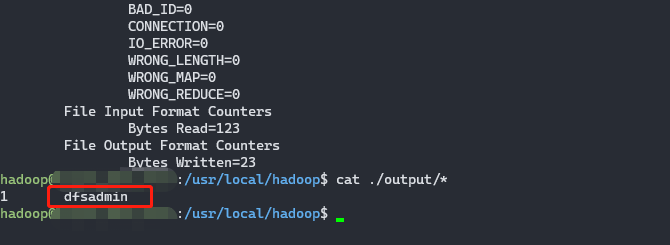

# Hadoop Install

## 单机版

### 需要的软件/工具
```shell script
jdk-8u162-linux-x64.tar.gz

```
### 环境
本教程使用 Ubuntu 18.04 64位 作为系统环境（或者Ubuntu 14.04，Ubuntu16.04 也行，32位、64位均可），请自行安装系统（可参考使用VirtualBox安装Ubuntu）。

装好了 Ubuntu 系统之后，在安装 Hadoop 前还需要做一些必备工作。

### 创建hadoop用户
如果你安装 Ubuntu 的时候不是用的 “hadoop” 用户，那么需要增加一个名为 hadoop 的用户。

首先按 ctrl+alt+t 打开终端窗口，输入如下命令创建新用户 :

```shell script
sudo useradd -m hadoop -s /bin/bash
```
这条命令创建了可以登陆的 hadoop 用户，并使用 /bin/bash 作为 shell。

接着使用如下命令设置密码，可简单设置为 hadoop，按提示输入两次密码：
```shell script
sudo passwd hadoop
```
可为 hadoop 用户增加管理员权限，方便部署，避免一些对新手来说比较棘手的权限问题：
```shell script
sudo adduser hadoop sudo
```
最后注销当前用户（点击屏幕右上角的齿轮，选择注销），返回登陆界面。在登陆界面中选择刚创建的 hadoop 用户进行登陆。

### 更新apt
用 hadoop 用户登录后，我们先更新一下 apt，后续我们使用 apt 安装软件，如果没更新可能有一些软件安装不了。按 ctrl+alt+t 打开终端窗口，执行如下命令：
```shell script
sudo apt-get update
```

### 安装vim
```shell script
sudo apt-get install vim
```

### 安装SSH、配置SSH无密码登陆
集群、单节点模式都需要用到 SSH 登陆（类似于远程登陆，你可以登录某台 Linux 主机，并且在上面运行命令），Ubuntu 默认已安装了 SSH client，此外还需要安装 SSH server：
```shell script
sudo apt-get install openssh-server
```
安装后，可以使用如下命令登陆本机：
```shell script
ssh localhost
```
此时会有如下提示(SSH首次登陆提示)，输入 yes 。然后按提示输入密码 hadoop，这样就登陆到本机了。

但这样登陆是需要每次输入密码的，我们需要配置成SSH无密码登陆比较方便。

首先退出刚才的 ssh，就回到了我们原先的终端窗口，然后利用 ssh-keygen 生成密钥，并将密钥加入到授权中：
```shell script
exit                                             # 退出刚才的 ssh localhost
cd ~/.ssh/                                       # 若没有该目录，请先执行一次ssh localhost
ssh-keygen -t rsa                                # 会有提示，都按回车就可以
cat ./id_rsa.pub >> ./authorized_keys            # 加入授权
```

### 安装Java环境
手动安装，推荐采用本方式

Hadoop3.1.3需要JDK版本在1.8及以上。需要按照下面步骤来自己手动安装JDK1.8。
我们已经把JDK1.8的安装包jdk-8u162-linux-x64.tar.gz放在了百度云盘，可以点击这里到百度云盘下载JDK1.8安装包（提取码：lnwl）。请把压缩格式的文件jdk-8u162-linux-x64.tar.gz下载到本地电脑，假设保存在“/home/linziyu/Downloads/”目录下。

在Linux命令行界面中，执行如下Shell命令（注意：当前登录用户名是hadoop）：
```shell script
cd /usr/lib
sudo mkdir jvm                                                #创建/usr/lib/jvm目录用来存放JDK文件
cd ~                                                          #进入hadoop用户的主目录
cd Downloads                                                  #注意区分大小写字母，刚才已经通过FTP软件把JDK安装包jdk-8u162-linux-x64.tar.gz上传到该目录下
sudo tar -zxvf ./jdk-8u162-linux-x64.tar.gz -C /usr/lib/jvm   #把JDK文件解压到/usr/lib/jvm目录下
```
上面使用了解压缩命令tar，如果对Linux命令不熟悉，可以参考常用的Linux命令用法。

JDK文件解压缩以后，可以执行如下命令到/usr/lib/jvm目录查看一下：
```shell script
cd /usr/lib/jvm
ls
```
可以看到，在/usr/lib/jvm目录下有个jdk1.8.0_162目录。
下面继续执行如下命令，设置环境变量：
```shell script
cd ~
vim ~/.bashrc
```
上面命令使用vim编辑器（查看vim编辑器使用方法）打开了hadoop这个用户的环境变量配置文件，请在这个文件的开头位置，添加如下几行内容：
```shell script
# java
export JAVA_HOME=/usr/lib/jvm/jdk1.8.0_162
export JRE_HOME=${JAVA_HOME}/jre
export CLASSPATH=.:${JAVA_HOME}/lib:${JRE_HOME}/lib
export PATH=${JAVA_HOME}/bin:$PATH
```
保存.bashrc文件并退出vim编辑器。然后，继续执行如下命令让.bashrc文件的配置立即生效：
```shell script
source ~/.bashrc
```
这时，可以使用如下命令查看是否安装成功：
```shell script
java -version
```
如果能够在屏幕上返回如下信息，则说明安装成功：
```shell script
hadoop@ubuntu:~$ java -version
java version "1.8.0_162"
Java(TM) SE Runtime Environment (build 1.8.0_162-b12)
Java HotSpot(TM) 64-Bit Server VM (build 25.162-b12, mixed mode)
```
至此，就成功安装了Java环境。下面就可以进入Hadoop的安装。

### 安装 Hadoop3.1.3
Hadoop安装文件，可以到Hadoop官网下载hadoop-3.1.3.tar.gz。
我们选择将 Hadoop 安装至 /usr/local/ 中：
```shell script
sudo tar -zxf ./hadoop-3.1.3.tar.gz -C /usr/local    # 解压到/usr/local中
cd /usr/local/
sudo mv ./hadoop-3.1.3/ ./hadoop            # 将文件夹名改为hadoop
sudo chown -R hadoop ./hadoop       # 修改文件权限
```
Hadoop 解压后即可使用。输入如下命令来检查 Hadoop 是否可用，成功则会显示 Hadoop 版本信息：
```shell script
cd /usr/local/hadoop
./bin/hadoop version
```

### Hadoop单机配置(非分布式)
Hadoop 默认模式为非分布式模式（本地模式），无需进行其他配置即可运行。非分布式即单 Java 进程，方便进行调试。

现在我们可以执行例子来感受下 Hadoop 的运行。Hadoop 附带了丰富的例子（运行 ./bin/hadoop jar ./share/hadoop/mapreduce/hadoop-mapreduce-examples-3.1.3.jar 可以看到所有例子），包括 wordcount、terasort、join、grep 等。

在此我们选择运行 grep 例子，我们将 input 文件夹中的所有文件作为输入，筛选当中符合正则表达式 dfs[a-z.]+ 的单词并统计出现的次数，最后输出结果到 output 文件夹中。
```shell script
cd /usr/local/hadoop
mkdir ./input
cp ./etc/hadoop/*.xml ./input   # 将配置文件作为输入文件
./bin/hadoop jar ./share/hadoop/mapreduce/hadoop-mapreduce-examples-3.1.3.jar grep ./input ./output 'dfs[a-z.]+'
cat ./output/*          # 查看运行结果
```
执行成功后如下所示，输出了作业的相关信息，输出的结果是符合正则的单词 dfsadmin 出现了1次


注意，Hadoop 默认不会覆盖结果文件，因此再次运行上面实例会提示出错，需要先将 ./output 删除。
```shell script
rm -r ./output
```

### Hadoop伪分布式配置
Hadoop 可以在单节点上以伪分布式的方式运行，Hadoop 进程以分离的 Java 进程来运行，节点既作为 NameNode 也作为 DataNode，同时，读取的是 HDFS 中的文件。

Hadoop 的配置文件位于 /usr/local/hadoop/etc/hadoop/ 中，伪分布式需要修改2个配置文件 core-site.xml 和 hdfs-site.xml 。Hadoop的配置文件是 xml 格式，每个配置以声明 property 的 name 和 value 的方式来实现。

修改配置文件 core-site.xml (通过 gedit 编辑会比较方便: gedit ./etc/hadoop/core-site.xml)，将当中的
```xml
<configuration>
</configuration>
```
修改为下面配置：
```xml
<configuration>
    <property>
        <name>hadoop.tmp.dir</name>
        <value>file:/usr/local/hadoop/tmp</value>
        <description>Abase for other temporary directories.</description>
    </property>
    <property>
        <name>fs.defaultFS</name>
        <value>hdfs://localhost:9000</value>
    </property>
</configuration>
```
同样的，修改配置文件 hdfs-site.xml：
```xml
<configuration>
    <property>
        <name>dfs.replication</name>
        <value>1</value>
    </property>
    <property>
        <name>dfs.namenode.name.dir</name>
        <value>file:/usr/local/hadoop/tmp/dfs/name</value>
    </property>
    <property>
        <name>dfs.datanode.data.dir</name>
        <value>file:/usr/local/hadoop/tmp/dfs/data</value>
    </property>
</configuration>
```
```xml
Hadoop配置文件说明
Hadoop 的运行方式是由配置文件决定的（运行 Hadoop 时会读取配置文件），因此如果需要从伪分布式模式切换回非分布式模式，需要删除 core-site.xml 中的配置项。

此外，伪分布式虽然只需要配置 fs.defaultFS 和 dfs.replication 就可以运行（官方教程如此），不过若没有配置 hadoop.tmp.dir 参数，则默认使用的临时目录为 /tmp/hadoo-hadoop，而这个目录在重启时有可能被系统清理掉，导致必须重新执行 format 才行。所以我们进行了设置，同时也指定 dfs.namenode.name.dir 和 dfs.datanode.data.dir，否则在接下来的步骤中可能会出错。
```
配置完成后，执行 NameNode 的格式化:
```shell script
cd /usr/local/hadoop
./bin/hdfs namenode -format
```
成功的话，会看到 “successfully formatted” 的提示，具体返回信息类似如下：
```shell script
2020-01-08 15:31:31,560 INFO namenode.NameNode: STARTUP_MSG: 
/************************************************************

STARTUP_MSG: Starting NameNode
STARTUP_MSG:   host = hadoop/127.0.1.1
STARTUP_MSG:   args = [-format]
STARTUP_MSG:  version = 3.1.3
*************************************************************/

......
2020-01-08 15:31:35,677 INFO common.Storage: Storage directory /usr/local/hadoop/tmp/dfs/name **has been successfully formatted**.
2020-01-08 15:31:35,700 INFO namenode.FSImageFormatProtobuf: Saving image file /usr/local/hadoop/tmp/dfs/name/current/fsimage.ckpt_0000000000000000000 using no compression
2020-01-08 15:31:35,770 INFO namenode.FSImageFormatProtobuf: Image file /usr/local/hadoop/tmp/dfs/name/current/fsimage.ckpt_0000000000000000000 of size 393 bytes saved in 0 seconds .
2020-01-08 15:31:35,810 INFO namenode.NNStorageRetentionManager: Going to retain 1 images with txid >= 0
2020-01-08 15:31:35,816 INFO namenode.FSImage: FSImageSaver clean checkpoint: txid = 0 when meet shutdown.
2020-01-08 15:31:35,816 INFO namenode.NameNode: SHUTDOWN_MSG:  
/************************************************************
SHUTDOWN_MSG: Shutting down NameNode at hadoop/127.0.1.1
*************************************************************/
```
如果在这一步时提示 Error: JAVA_HOME is not set and could not be found. 的错误，则说明之前设置 JAVA_HOME 环境变量那边就没设置好，请按教程先设置好 JAVA_HOME 变量，否则后面的过程都是进行不下去的。如果已经按照前面教程在.bashrc文件中设置了JAVA_HOME，还是出现 Error: JAVA_HOME is not set and could not be found. 的错误，那么，请到hadoop的安装目录修改配置文件“/usr/local/hadoop/etc/hadoop/hadoop-env.sh”，在里面找到“export JAVA_HOME=${JAVA_HOME}”这行，然后，把它修改成JAVA安装路径的具体地址，比如，“export JAVA_HOME=/usr/lib/jvm/default-java”，然后，再次启动Hadoop。

接着开启 NameNode 和 DataNode 守护进程。
```shell script
cd /usr/local/hadoop
./sbin/start-dfs.sh                 #start-dfs.sh是个完整的可执行文件，中间没有空格
```
若出现如下SSH提示，输入yes即可。
```shell script
启动时可能会出现如下 WARN 提示：WARN util.NativeCodeLoader: Unable to load native-hadoop library for your platform… using builtin-java classes where applicable WARN 提示可以忽略，并不会影响正常使用。
```
启动 Hadoop 时提示 Could not resolve hostname
如果启动 Hadoop 时遇到输出非常多“ssh: Could not resolve hostname xxx”的异常情况,这个并不是 ssh 的问题，可通过设置 Hadoop 环境变量来解决。首先按键盘的 ctrl + c 中断启动，然后在 ~/.bashrc 中，增加如下两行内容（设置过程与 JAVA_HOME 变量一样，其中 HADOOP_HOME 为 Hadoop 的安装目录）：
 ```shell script
export HADOOP_HOME=/usr/local/hadoop
export HADOOP_COMMON_LIB_NATIVE_DIR=$HADOOP_HOME/lib/native
```
保存后，务必执行 source ~/.bashrc 使变量设置生效，然后再次执行 ./sbin/start-dfs.sh 启动 Hadoop。